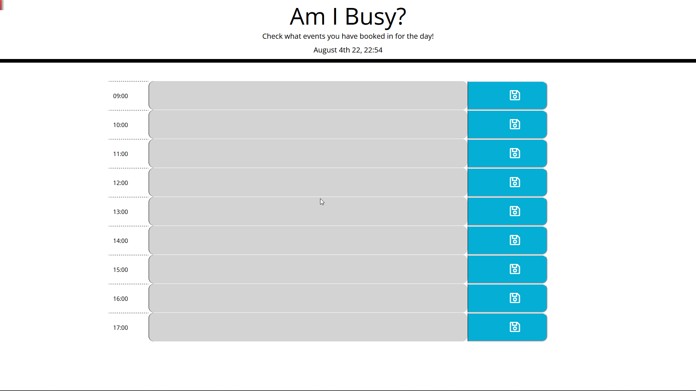

# Am I Busy

## A web application to help you plan your work day!

### What was my motivation?
To become even more efficient at work and better plan the day with a lightweight application that is easy to use.

### What did I do?
Used the provided starter code as a base and build up the html, css and js file to add functionality as well as add my unique design.

### What did I learn?
How to link and code with very powerful external resources like Font Awesome, Google Fonts and Bootstrap, JQuery, and moment.js to enable the use of advanced features.   

## Usage.

To use the application follow the link and be sure to add all your events in the corresponding time.  

(https://nxtera.github.io/Thats-So-Random/)

Screenshot of live page (sample)

 
   
## Credits
Created readme with help from https://coding-boot-camp.github.io/full-stack/github/professional-readme-guide

## License
Please refer to UNLICENSE.txt
.
